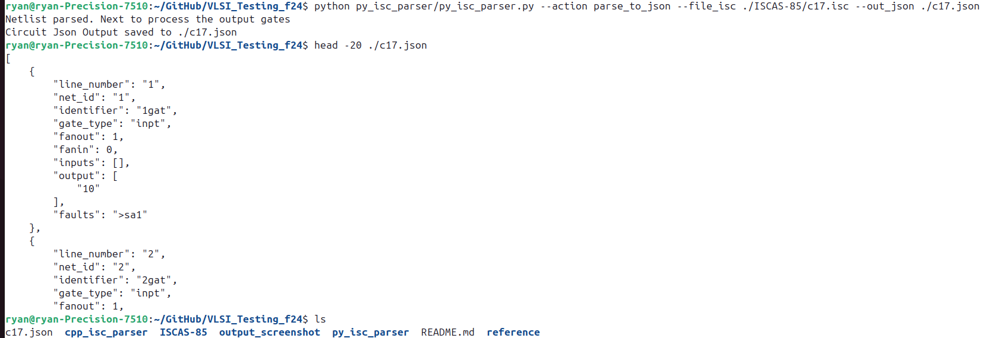
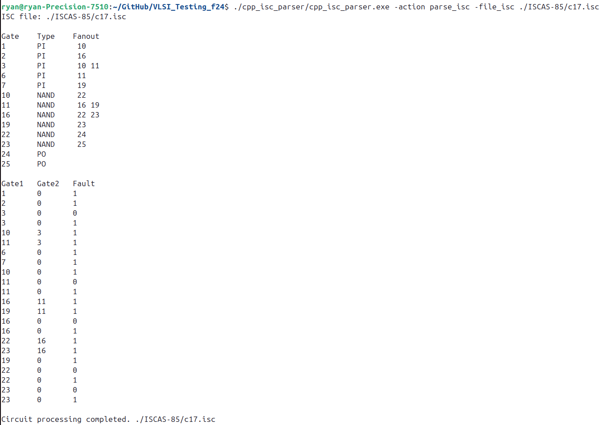
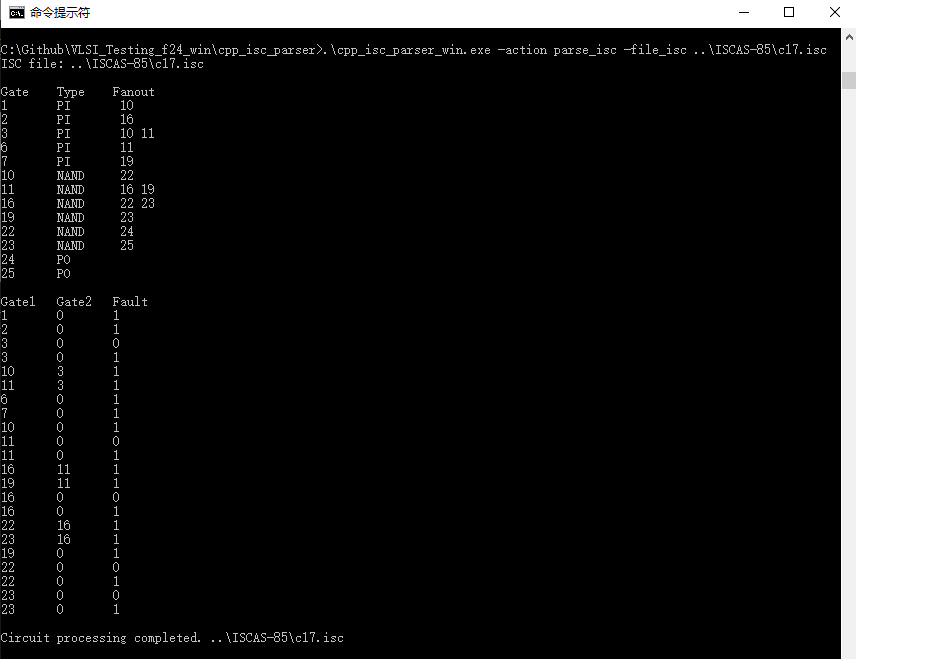

# VLSI-Testing Project 1

This project is a VLSI testing tool designed to parse ISC files and populate the circuit netlist. The tool is implemented in C++ and Python, offering various functionalities for circuit analysis and testing.

## Binaries and Scripts 
The compiled C++ binaries are located in directory `cpp_isc_parser`. Both Linux and Windows versions are provided:

```
cpp_isc_parser.exe        # Linux binary
cpp_isc_parser_win.exe    # Windows binary
```

The Python script for parsing ISC files into JSON format can be found in the `py_isc_parser` directory:
```
py_isc_parser.py 
```

The project includes two implementations:
## Python Parser
The Python parser reads the ISC file, populates the netlist, and saves it to a Python file.
The Python parser implements requirement #1 and part of #2 in Programming Project 1 of the 654 VLSI Testing course, Fall 2004

### Python Parser Example:
```bash
$ python py_isc_parser/py_isc_parser.py --action parse_to_json --file_isc ./ISCAS-85/c17.isc  --out_json ./c17.json
Netlist parsed. Next to process the output gates
Circuit Json Output saved to ./c17.json

$ less ./c17.json
[
    {
        "line_number": "1",
        "net_id": "1",
        "identifier": "1gat",
        "gate_type": "inpt",
        "fanout": 1,
        "fanin": 0,
        "inputs": [],
        "output": [
            "10"
        ],
        "faults": ">sa1"
    },
    {
        ...
    }
]
```

More details can be found in `py_isc_parser/README.md`

## C++ Parser 
The C++ parser reads from the ISC file and parses it line by line to populate the circuit netlist.

It implements requirements #2, #3, and #4 of Programming Project 1 for the 654 VLSI Testing course, Fall 2004.

### How to run
The tool was developed on Ubuntu but has also been built and verified on Windows.

Linux binary:   `cpp_isc_parser.exe`

Windows binary: `cpp_isc_parser_win.exe`

### Build/Installation
```
cd cpp_isc_parser &&  make 
```

For Windows, building with MSYS2 UCRT64 is preferred.


### Usage
To run the tool, use the following command:

Linux:
```sh
./cpp_isc_parser.exe -action parse_isc -file_isc  <filename>
```

Windows:
```
cpp_isc_parser_win.exe -action parse_isc -file_isc  <filename>
```

### Cpp Parser Example
```bash
$ ./cpp_isc_parser/cpp_isc_parser.exe -action parse_isc -file_isc ./ISCAS-85/c17.isc 
ISC file: ./ISCAS-85/c17.isc

Gate	Type	Fanout
1	PI	 10
2	PI	 16
3	PI	 11 10
6	PI	 11
7	PI	 19
10	NAND	 22
11	NAND	 19 16
16	NAND	 23 22
19	NAND	 23
22	NAND	 24
23	NAND	 25
24	PO	
25	PO	

Gate1	Gate2	Fault
1	0	1
2	0	1
3	0	0
3	0	1
10	3	1
11	3	1
6	0	1
7	0	1
10	0	1
11	0	0
11	0	1
16	11	1
19	11	1
16	0	0
16	0	1
22	16	1
23	16	1
19	0	1
22	0	0
22	0	1
23	0	0
23	0	1

Circuit processing completed. ./ISCAS-85/c17.isc
```

## Project Screen
#### Python Parse ISC to Json



#### Cpp parse ISC for Gate_output and SA_fault.
Linux


Windows

